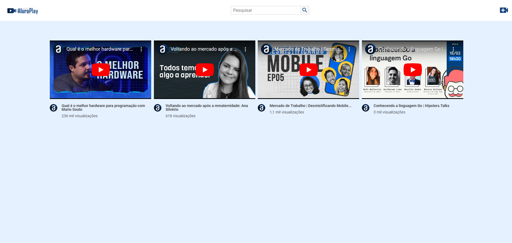
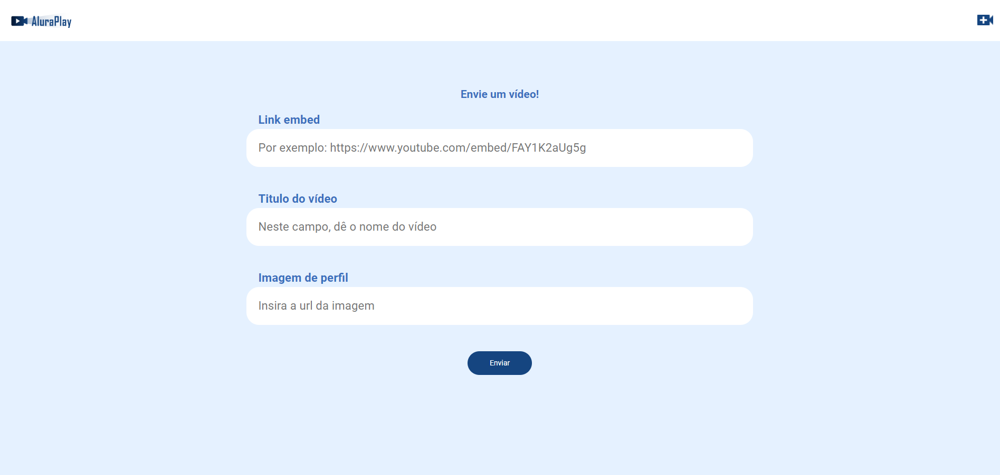

# Projetos Alura Oracle - ONE
 > Oracle Next Education Oracle

[Clique aqui para acessar o site]()

<h2 align="center">Youtube de vídeos | Alura Play</h2>

    </img>
    </img>

### Tecnologias utilizadas
    - Javascript
    - NodeJS
    - Json-server

### Para rodar o projeto
    - npm install json-server 
    - npx json-server db.json (rodando o json-server)

    > Home (json-server)
    http://localhost:3000

    > Resources
    http://localhost:3000/videos (local do json remoto)

[Acesse a API](https://my-json-server.typicode.com/)